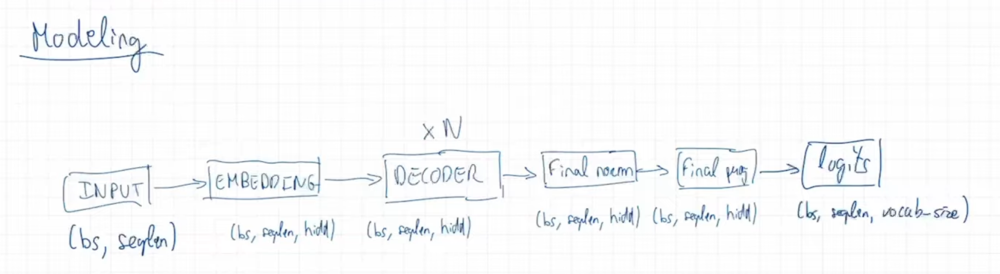
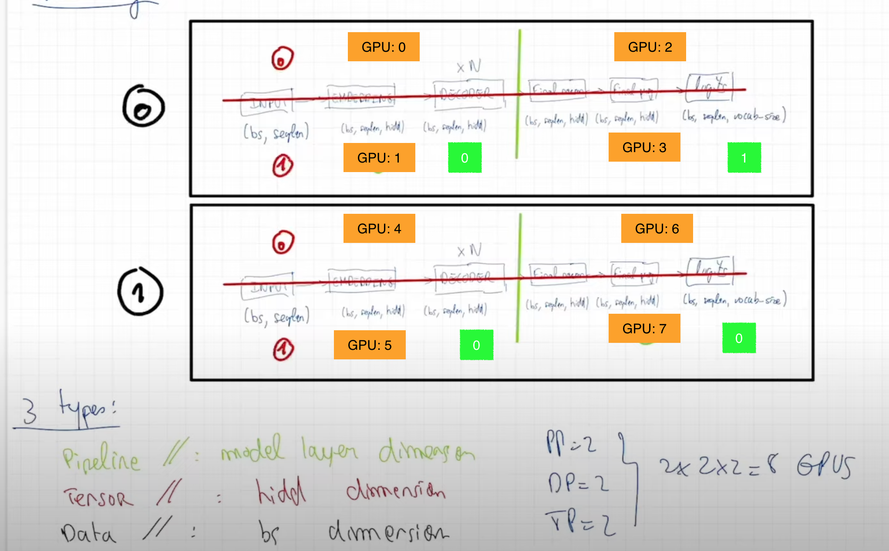

# Model, Process Group Manager, Dataloader








Notes:
To get a sanity check, we can run the model on a single GPU.

```bash
export PATH=$PATH:/sbin
cd step1_modeling/
torchrun --nproc_per_node 1 train.py
```

Loss should be around 11.0

